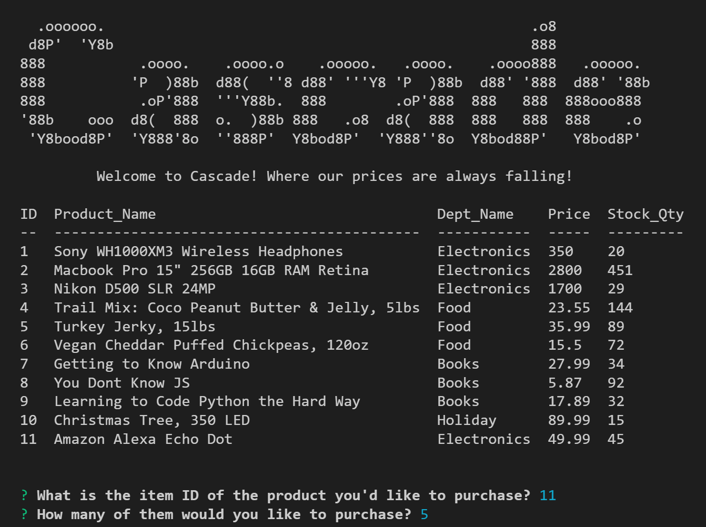

# Cascade - a Node.js & MYSQL Experience :department_store::credit_card::dollar::handbag:

##Welome to Cascade! WHere the Prices are always falling!
Cascade is a full shopping market that contains three separate abilities with sub-features. There are customer, manager and supervisor sections. In the following I will break each section down with video demos. This application is built using Node.JS, the NPM and MYSQL. 

## Cascade - Customer
In the customer section you can purchase any item in the inventory that is in stock. There is a great selection and money is unlimited!:wink:

###### click image for video

## Cascade - Manager
The manager area gives you more functions and abilities in order to best manage the store and help grow it!
- View Products for Sale
- View Low Inventory
- Add to Inventory
- Add New Product

###### click image for video

## Cascade - Supervisor
Last, but not least we have the Supervisor functionality. This allows an oversight view and expansion of departments.
- View Product Sales by Department
- Create New Department

###### click image for video

